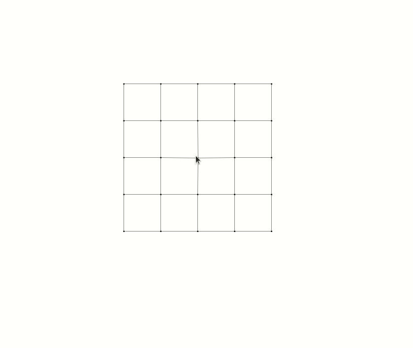

# Wobbly matrix

## What is this?

A geometric algorithm inspired by Ubuntu's wobbly windows.

Animated example:

## How to use

1. Clone or download.
2. Open `index.html`.
3. Move mouse to make it wobble.
4. (Optional) Configure `config.js` to create different effects.

## Future work

Map the matrix to an image and perform transformations to make the image wobble.

For example: https://open.gl/transformations

## Limitations

1. The movement might look bad if it's not properly configured.
2. The mechanism that prevents grid deformation doesn't work (it should wobble, but still be a grid. Sometimes it becomes an entirely different shape).
